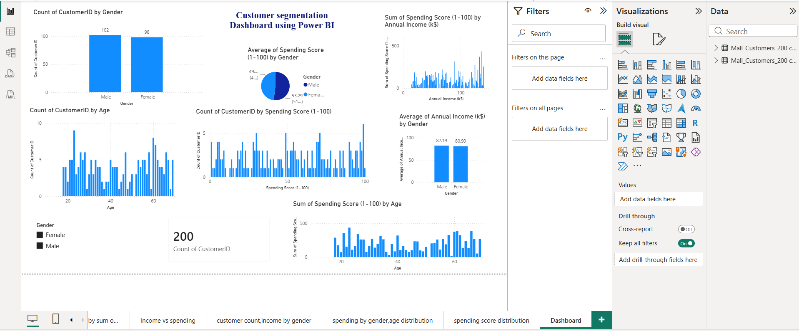

# Mall Customer Segmentation using Power BI

## Project Overview

This project focuses on analyzing mall customer data to understand customer demographics, spending behavior, and purchasing patterns using Microsoft Power BI.

The objective is to transform raw customer data into meaningful visual insights that can support customer segmentation and data-driven decision-making.

## Objectives

- Analyze customer demographics and purchasing behavior.
- Identify patterns based on annual income and spending score.
- Compare customer characteristics across different groups.
- Build an interactive dashboard for easy exploration of customer data.
- Present key insights through clear and effective data visualizations.

## Dataset

The dataset contains information about mall customers, including attributes such as:

- Customer ID
- Gender
- Age
- Annual Income
- Spending Score

## Tools & Technologies

- Microsoft Power BI
- Power Query
- Data Visualization
- Data Analysis
- DAX

## Dashboard

The Power BI dashboard provides visual insights into customer demographics, income distribution, spending behavior, and customer segments.

## Key Insights

The analysis helps identify differences in customer behavior based on demographic and financial characteristics. These insights can be used to understand customer groups and support targeted marketing strategies.

## Skills Demonstrated

- Data cleaning and transformation
- Exploratory data analysis
- Data visualization
- Dashboard development
- Power BI
- Power Query
- DAX
- Business-oriented data interpretation

## Conclusion

This project demonstrates the use of Power BI to transform customer data into an interactive and informative dashboard, providing actionable insights into customer behavior and segmentation.
